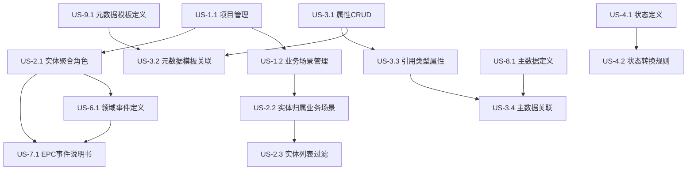
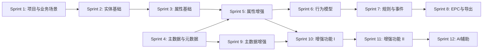

# Ontology 项目迭代计划 v2.0

> 基于 Ralph Loop 方法论 + 评审反馈改进
> 生成时间：2026-04-19
> 版本：v2.0

---

## 一、依赖关系图



---

## 二、迭代总览（重新划分）

### Sprint 依赖关系图



### Sprint 计划

| Sprint | 主题 | Story Points | User Stories | 周期 |
|--------|------|--------------|--------------|------|
| Sprint 1 | 项目与业务场景基础 | 8 | US-1.1, US-1.2 | 2周 |
| Sprint 2 | 实体基础 | 10 | US-2.1, US-2.2, US-2.3 | 2周 |
| Sprint 3 | 属性基础 | 5 | US-3.1 | 2周 |
| Sprint 4 | 主数据与元数据 | 5 | US-8.1, US-9.1 | 2周 |
| Sprint 5 | 属性增强 | 8 | US-3.2, US-3.3 | 2周 |
| Sprint 6 | 行为模型 | 8 | US-4.1, US-4.2 | 2周 |
| Sprint 7 | 规则与事件模型 | 6 | US-5.1, US-6.1 | 2周 |
| Sprint 8 | EPC与导出 | 10 | US-7.1, US-10.1, US-10.2 | 2周 |
| Sprint 9 | 主数据增强 | 8 | US-8.2, US-8.3 | 2周 |
| Sprint 10 | 增强功能 I | 8 | US-3.4, US-3.5, US-4.3 | 2周 |
| Sprint 11 | 增强功能 II | 8 | US-5.2, US-5.3, US-6.2, US-7.2 | 2周 |
| Sprint 12 | AI辅助 | 5 | US-11.1, US-11.2 | 2周 |

**说明**：
- 每个 Sprint 预留 20% 时间处理技术债务
- Story Points 估算：1=简单, 2=中等, 3=复杂, 5=很复杂, 8=极复杂
- 单个 Sprint 总 Points 不超过 13

---

## 三、质量门禁

每个 Sprint 完成前必须通过以下检查：

### 代码质量
- [ ] TypeScript 严格模式无错误
- [ ] ESLint 无警告
- [ ] 代码覆盖率 ≥ 80%
- [ ] 关键路径覆盖率 = 100%

### 性能基准
- [ ] API 响应时间 < 200ms (P95)
- [ ] 页面加载时间 < 2s (P95)
- [ ] 数据库查询优化（无 N+1 问题）

### 安全检查
- [ ] SQL 注入防护
- [ ] XSS 防护
- [ ] CSRF 防护
- [ ] 敏感数据加密

### 功能验证
- [ ] 所有测试用例通过
- [ ] 功能演示通过
- [ ] 用户验收测试通过

---

## 四、风险评估

| 风险ID | 风险描述 | 级别 | 概率 | 影响 | 应对策略 |
|--------|----------|------|------|------|----------|
| R-001 | AI 模型调用失败 | 高 | 中 | 高 | 添加重试机制、降级方案 |
| R-002 | 性能瓶颈 | 中 | 中 | 高 | 性能基准测试、优化索引 |
| R-003 | 需求变更 | 中 | 高 | 中 | 敏捷迭代、快速响应 |
| R-004 | 技术债务累积 | 中 | 高 | 中 | 每个 Sprint 预留 20% |
| R-005 | 数据迁移问题 | 高 | 低 | 高 | 制定迁移计划、回滚方案 |

---

## 五、Sprint 详细计划

---

## Sprint 1: 项目与业务场景基础

**周期**: 2周 | **Story Points**: 8 | **技术债务预留**: 20%

### US-1.1 项目管理

**User Story**: 作为架构师，我需要创建项目分组，以便按领域组织建模工作

**Story Points**: 5

**依赖**: 无

**验收标准**:

- [ ] **项目创建接口** POST /api/projects
  - Request: `{ name: string, domain: string, description?: string }`
  - Response: `{ id: string, name: string, domain: string, createdAt: string }`
  - 错误码: 400 (参数错误), 409 (名称重复), 500 (服务器错误)

- [ ] **项目列表接口** GET /api/projects
  - 支持分页: `?page=1&size=20`
  - 支持过滤: `?domain=finance`
  - 响应时间 < 200ms (1000条数据)

- [ ] **项目更新接口** PUT /api/projects/[id]
  - 只允许更新 name 和 description
  - domain 字段不可修改

- [ ] **项目删除接口** DELETE /api/projects/[id]
  - 软删除，设置 deletedAt 字段
  - 有关联业务场景时拒绝删除，返回 409

- [ ] **项目按领域分组显示**
  - 前端组件支持折叠/展开
  - 每个领域显示项目数量

**测试用例**:

| ID | 类型 | 描述 | 预期结果 |
|----|------|------|----------|
| TC-1.1.1 | 正常 | 创建项目 - 所有字段 | 201, 返回项目ID |
| TC-1.1.2 | 正常 | 创建项目 - 仅必填字段 | 201 |
| TC-1.1.3 | 异常 | 创建项目 - 缺少 name | 400 |
| TC-1.1.4 | 异常 | 创建项目 - 名称重复 | 409 |
| TC-1.1.5 | 边界 | 创建项目 - name 超长(>100字符) | 400 |
| TC-1.1.6 | 边界 | 创建项目 - description 超长(>1000字符) | 400 |
| TC-1.1.7 | 正常 | 更新项目 - 修改 name | 200 |
| TC-1.1.8 | 异常 | 更新项目 - 修改 domain | 400 |
| TC-1.1.9 | 正常 | 删除项目 - 无关联 | 200 |
| TC-1.1.10 | 异常 | 删除项目 - 有关联业务场景 | 409 |
| TC-1.1.11 | 性能 | 项目列表 - 1000条数据 | < 200ms |
| TC-1.1.12 | 性能 | 项目列表 - 并发100请求 | 全部成功 |

**涉及文件**:

| 类型 | 文件路径 |
|------|----------|
| 源码 | src/app/api/projects/route.ts |
| 源码 | src/app/api/projects/[id]/route.ts |
| 源码 | src/components/ontology/project-list.tsx |
| 源码 | src/components/ontology/project-setup.tsx |
| 源码 | src/services/project-service.ts |
| 类型 | src/types/ontology.ts |
| 测试 | src/app/api/projects/route.test.ts |
| 测试 | src/app/api/projects/[id]/route.test.ts |
| 测试 | tests/integration/project.test.ts |

---

### US-1.2 业务场景管理

**User Story**: 作为架构师，我需要为项目创建业务场景，以便明确实体归属边界

**Story Points**: 3

**依赖**: US-1.1

**验收标准**:

- [ ] **业务场景创建接口** POST /api/business-scenarios
  - Request: `{ name: string, nameEn?: string, description?: string, projectId: string, color?: string }`
  - Response: `{ id: string, name: string, projectId: string, createdAt: string }`
  - 错误码: 400 (参数错误), 404 (项目不存在), 409 (名称重复)

- [ ] **业务场景列表接口** GET /api/business-scenarios
  - 支持按项目过滤: `?projectId=xxx`
  - 响应时间 < 100ms

- [ ] **业务场景更新接口** PUT /api/business-scenarios/[id]
  - 允许更新 name, nameEn, description, color

- [ ] **业务场景删除接口** DELETE /api/business-scenarios/[id]
  - 有关联实体时拒绝删除，返回 409

- [ ] **实体创建时必须选择业务场景**
  - 前端表单显示业务场景下拉
  - 后端校验 businessScenarioId 必填

**测试用例**:

| ID | 类型 | 描述 | 预期结果 |
|----|------|------|----------|
| TC-1.2.1 | 正常 | 创建业务场景 - 所有字段 | 201 |
| TC-1.2.2 | 异常 | 创建业务场景 - 缺少 projectId | 400 |
| TC-1.2.3 | 异常 | 创建业务场景 - 项目不存在 | 404 |
| TC-1.2.4 | 异常 | 创建业务场景 - 名称重复 | 409 |
| TC-1.2.5 | 正常 | 业务场景列表 - 按项目过滤 | 200 |
| TC-1.2.6 | 异常 | 删除业务场景 - 有关联实体 | 409 |

**涉及文件**:

| 类型 | 文件路径 |
|------|----------|
| 源码 | src/app/api/business-scenarios/route.ts |
| 源码 | src/app/api/business-scenarios/[id]/route.ts |
| 源码 | src/components/ontology/modeling-workspace.tsx |
| 源码 | src/store/ontology-store.ts |
| 类型 | src/types/ontology.ts |
| 测试 | src/app/api/business-scenarios/route.test.ts |

---

## Sprint 2: 实体基础

**周期**: 2周 | **Story Points**: 13 | **技术债务预留**: 20%

### US-2.1 实体聚合角色

**User Story**: 作为架构师，我需要创建实体并标记聚合角色，以便明确 DDD 边界

**Story Points**: 5

**依赖**: US-1.1

**验收标准**:

- [ ] **实体创建接口** POST /api/entities
  - Request: `{ name: string, nameEn: string, projectId: string, businessScenarioId: string, entityRole: 'aggregate_root' | 'child_entity', parentAggregateId?: string }`
  - entityRole = 'child_entity' 时，parentAggregateId 必填
  - entityRole = 'aggregate_root' 时，parentAggregateId 必须为空

- [ ] **聚合根约束**
  - 只有聚合根可发布领域事件
  - 子实体创建事件时返回 400

- [ ] **级联删除策略**
  - 删除聚合根时，提示用户将同时删除所有子实体
  - 可配置级联删除或阻止删除

**测试用例**:

| ID | 类型 | 描述 | 预期结果 |
|----|------|------|----------|
| TC-2.1.1 | 正常 | 创建聚合根 | 201 |
| TC-2.1.2 | 正常 | 创建子实体 - 指定父聚合 | 201 |
| TC-2.1.3 | 异常 | 创建子实体 - 未指定父聚合 | 400 |
| TC-2.1.4 | 异常 | 创建聚合根 - 指定父聚合 | 400 |
| TC-2.1.5 | 异常 | 子实体发布事件 | 400 |
| TC-2.1.6 | 正常 | 删除聚合根 - 级联删除子实体 | 200 |
| TC-2.1.7 | 边界 | 父聚合不存在 | 404 |

**涉及文件**:

| 类型 | 文件路径 |
|------|----------|
| 源码 | src/lib/entity-role.ts |
| 源码 | src/components/ontology/data-model-editor.tsx |
| 源码 | src/store/ontology-store.ts |
| 类型 | src/types/ontology.ts |
| 测试 | src/lib/entity-role.test.ts |

---

### US-2.2 实体归属业务场景

**User Story**: 作为架构师，我需要为实体归属业务场景，以便按场景组织实体

**Story Points**: 3

**依赖**: US-1.2, US-2.1

**验收标准**:

- [ ] **创建实体时 businessScenarioId 必填**
  - 前端表单显示业务场景下拉
  - 后端校验 businessScenarioId 非空

- [ ] **创建后 businessScenarioId 不可更改**
  - 更新接口拒绝修改 businessScenarioId
  - 返回 400 错误

- [ ] **历史数据补录**
  - 提供数据迁移脚本
  - 为无 businessScenarioId 的实体设置默认值

**测试用例**:

| ID | 类型 | 描述 | 预期结果 |
|----|------|------|----------|
| TC-2.2.1 | 正常 | 创建实体 - 有 businessScenarioId | 201 |
| TC-2.2.2 | 异常 | 创建实体 - 无 businessScenarioId | 400 |
| TC-2.2.3 | 异常 | 更新实体 - 修改 businessScenarioId | 400 |
| TC-2.2.4 | 边界 | businessScenarioId 不存在 | 404 |

**涉及文件**:

| 类型 | 文件路径 |
|------|----------|
| 源码 | src/store/ontology-store.ts |
| 源码 | src/components/ontology/data-model-editor.tsx |
| 脚本 | scripts/migrate-entity-scenario.ts |

---

### US-2.3 实体列表过滤

**User Story**: 作为架构师，我需要查看当前业务场景下的实体列表，以便聚焦建模

**Story Points**: 2

**依赖**: US-2.2

**验收标准**:

- [ ] **实体列表按 businessScenarioId 过滤**
  - API 支持 `?businessScenarioId=xxx`
  - 前端切换场景后列表自动刷新

- [ ] **未选场景时禁用"新建实体"按钮**
  - 显示提示："请先选择业务场景"

- [ ] **实体详情页显示归属业务场景**
  - 只读字段，不可编辑

**测试用例**:

| ID | 类型 | 描述 | 预期结果 |
|----|------|------|----------|
| TC-2.3.1 | 正常 | 选择场景 - 列表显示该场景实体 | 200 |
| TC-2.3.2 | 正常 | 切换场景 - 列表更新 | 200 |
| TC-2.3.3 | UI | 未选场景 - 新建实体按钮禁用 | 按钮灰显 |
| TC-2.3.4 | 性能 | 实体列表 - 500条数据 | < 200ms |

**涉及文件**:

| 类型 | 文件路径 |
|------|----------|
| 源码 | src/components/ontology/modeling-workspace.tsx |
| 源码 | src/app/api/entities/route.ts |

---

## Sprint 3: 属性基础

**周期**: 2周 | **Story Points**: 5 | **技术债务预留**: 20%

### US-3.1 属性 CRUD

**User Story**: 作为架构师，我需要为实体添加属性，以便定义数据结构

**Story Points**: 5

**依赖**: US-2.1

**验收标准**:

- [ ] **属性创建接口** POST /api/entities/[id]/attributes
  - Request: `{ name: string, nameEn: string, dataType: AttributeDataType, required?: boolean, unique?: boolean, defaultValue?: string }`
  - dataType: 'string' | 'text' | 'integer' | 'decimal' | 'boolean' | 'date' | 'datetime' | 'enum' | 'reference'
  - Response: `{ id: string, name: string, entityId: string, createdAt: string }`
  - 错误码: 400 (参数错误), 404 (实体不存在), 409 (属性名重复)

- [ ] **属性名唯一性校验**
  - 同一实体内属性名不可重复
  - 返回 409 错误

- [ ] **属性更新接口** PUT /api/entities/[id]/attributes/[attrId]
- [ ] **属性删除接口** DELETE /api/entities/[id]/attributes/[attrId]

**测试用例**:

| ID | 类型 | 描述 | 预期结果 |
|----|------|------|----------|
| TC-3.1.1 | 正常 | 创建属性 - string 类型 | 201 |
| TC-3.1.2 | 正常 | 创建属性 - reference 类型 | 201 |
| TC-3.1.3 | 异常 | 创建属性 - 重复名称 | 409 |
| TC-3.1.4 | 边界 | 创建属性 - name 超长(>100字符) | 400 |
| TC-3.1.5 | 正常 | 删除属性 | 200 |

**涉及文件**:

| 类型 | 文件路径 |
|------|----------|
| 源码 | src/components/ontology/data-model-editor.tsx |
| 类型 | src/types/ontology.ts |
| 测试 | tests/unit/attribute.test.ts |

---

## Sprint 4: 主数据与元数据

**周期**: 2周 | **Story Points**: 5 | **技术债务预留**: 20%

### US-8.1 主数据定义

**User Story**: 作为架构师，我需要定义主数据类型，以便管理业务基础数据

**Story Points**: 3

**依赖**: 无

**验收标准**:

- [ ] **主数据定义创建接口** POST /api/master-data
  - Request: `{ name: string, nameEn: string, domain: string, fieldNames: string }`
  - fieldNames: 逗号分隔的字段名列表
  - Response: `{ id: string, name: string, fieldNames: string[], createdAt: string }`

- [ ] **fieldNames 动态解析**
  - 支持中英文逗号分隔
  - 去空格、去空项、保留顺序

- [ ] **动态表生成**
  - 根据 fieldNames 生成表头
  - 生成录入表单

**测试用例**:

| ID | 类型 | 描述 | 预期结果 |
|----|------|------|----------|
| TC-8.1.1 | 正常 | 创建主数据定义 | 201 |
| TC-8.1.2 | 边界 | fieldNames 解析 - 中英文逗号 | 正确解析 |
| TC-8.1.3 | 异常 | fieldNames 为空 | 400 |

**涉及文件**:

| 类型 | 文件路径 |
|------|----------|
| 源码 | src/components/ontology/masterdata-manager.tsx |
| 源码 | src/lib/masterdata/field-parser.ts |
| 测试 | src/lib/masterdata/field-parser.test.ts |

---

### US-9.1 元数据模板定义

**User Story**: 作为架构师，我需要定义元数据模板，以便标准化字段属性

**Story Points**: 2

**依赖**: 无

**验收标准**:

- [ ] **元数据模板创建接口** POST /api/metadata-templates
  - Request: `{ name: string, nameEn: string, dataType: string, length?: number, constraints?: object }`
  - Response: `{ id: string, name: string, dataType: string, createdAt: string }`

- [ ] **元数据模板列表接口** GET /api/metadata-templates
- [ ] **元数据模板更新接口** PUT /api/metadata-templates/[id]
- [ ] **元数据模板删除接口** DELETE /api/metadata-templates/[id]

**测试用例**:

| ID | 类型 | 描述 | 预期结果 |
|----|------|------|----------|
| TC-9.1.1 | 正常 | 创建元数据模板 | 201 |
| TC-9.1.2 | 异常 | 创建模板 - 无效类型 | 400 |
| TC-9.1.3 | 正常 | 模板列表 | 200 |

**涉及文件**:

| 类型 | 文件路径 |
|------|----------|
| 源码 | src/components/ontology/metadata-manager.tsx |
| 类型 | src/types/ontology.ts |

---

## Sprint 5: 属性增强

**周期**: 2周 | **Story Points**: 8 | **技术债务预留**: 20%

### US-3.2 元数据模板关联

**User Story**: 作为架构师，我需要关联元数据模板，以便确保字段标准一致性

**Story Points**: 5

**依赖**: US-3.1, US-9.1

**验收标准**:

- [ ] **属性编辑时可选择元数据模板**
  - 下拉列表显示可用模板
  - 选择后类型自动填充（只读）

- [ ] **关联后数据类型由模板决定**
  - 禁止手动修改类型
  - 模板变更时提示影响分析

- [ ] **模板版本管理**
  - 模板变更时创建新版本
  - 已关联属性可选择升级或保持

**测试用例**:

| ID | 类型 | 描述 | 预期结果 |
|----|------|------|----------|
| TC-3.2.1 | 正常 | 关联元数据模板 - 类型自动填充 | 200 |
| TC-3.2.2 | 异常 | 关联后修改类型 | 400 |
| TC-3.2.3 | 正常 | 解除关联 - 类型可编辑 | 200 |
| TC-3.2.4 | 边界 | 模板被删除 | 提示影响 |

**涉及文件**:

| 类型 | 文件路径 |
|------|----------|
| 源码 | src/components/ontology/data-model-editor.tsx |
| 源码 | src/components/ontology/metadata-manager.tsx |

---

### US-3.3 引用类型属性

**User Story**: 作为架构师，我需要创建引用类型属性，以便表达实体关系

**Story Points**: 3

**依赖**: US-3.1

**验收标准**:

- [ ] **引用类型时显示选择**
  - "引用实体" 或 "引用主数据" 二选一
  - 互斥校验

- [ ] **引用实体**
  - 下拉列表显示本项目中的实体
  - 存储 referencedEntityId

- [ ] **引用主数据**
  - 设置 isMasterDataRef = true
  - 选择主数据类型

**测试用例**:

| ID | 类型 | 描述 | 预期结果 |
|----|------|------|----------|
| TC-3.3.1 | 正常 | 引用实体 | 201 |
| TC-3.3.2 | 正常 | 引用主数据 | 201 |
| TC-3.3.3 | 异常 | 同时引用实体和主数据 | 400 |

**涉及文件**:

| 类型 | 文件路径 |
|------|----------|
| 源码 | src/components/ontology/data-model-editor.tsx |

---

## Sprint 6-12: 后续 Sprint 概要

| Sprint | User Stories | 关键验收标准 |
|--------|--------------|--------------|
| Sprint 6 | US-4.1, US-4.2 | 状态定义、状态转换规则 |
| Sprint 7 | US-5.1, US-6.1 | 验证规则、领域事件 |
| Sprint 8 | US-7.1, US-10.1, US-10.2 | EPC 说明书、版本快照、配置导出 |
| Sprint 9 | US-8.2, US-8.3 | 主数据导入、主数据 CRUD |
| Sprint 10 | US-3.4, US-3.5, US-4.3 | 主数据关联、实体关系、状态触发器 |
| Sprint 11 | US-5.2, US-5.3, US-6.2, US-7.2 | 跨字段验证、业务约束、事件订阅、EPC 导出 |
| Sprint 12 | US-11.1, US-11.2 | AI 模型建议、一键应用 |

---

## 六、API 契约定义

### 通用响应格式

```typescript
// 成功响应
interface SuccessResponse<T> {
  success: true;
  data: T;
}

// 错误响应
interface ErrorResponse {
  success: false;
  error: {
    code: string;
    message: string;
    details?: Record<string, unknown>;
  };
}
```

### 错误码定义

| 错误码 | HTTP状态码 | 描述 |
|--------|------------|------|
| VALIDATION_ERROR | 400 | 参数校验失败 |
| NOT_FOUND | 404 | 资源不存在 |
| CONFLICT | 409 | 资源冲突 |
| INTERNAL_ERROR | 500 | 服务器内部错误 |

---

## 七、数据迁移策略

### 版本升级原则

1. **兼容性变更**: 新增可选字段，不影响现有数据
2. **破坏性变更**: 提供迁移脚本，支持回滚
3. **数据补录**: 为历史数据填充默认值

### 迁移脚本命名规范

```
scripts/migrations/
├── V001__add_business_scenario_id.ts
├── V002__add_entity_role.ts
└── V003__add_metadata_template_version.ts
```

---

## 八、进度追踪

| Sprint | 开始日期 | 结束日期 | 完成度 | 备注 |
|--------|----------|----------|--------|------|
| Sprint 1 | - | - | 0% | 待开始 |
| Sprint 2 | - | - | 0% | 待开始 |
| Sprint 3 | - | - | 0% | 待开始 |
| Sprint 4 | - | - | 0% | 待开始 |
| Sprint 5 | - | - | 0% | 待开始 |
| Sprint 6 | - | - | 0% | 待开始 |
| Sprint 7 | - | - | 0% | 待开始 |
| Sprint 8 | - | - | 0% | 待开始 |
| Sprint 9 | - | - | 0% | 待开始 |
| Sprint 10 | - | - | 0% | 待开始 |
| Sprint 11 | - | - | 0% | 待开始 |
| Sprint 12 | - | - | 0% | 待开始 |

---

## 九、监控和告警策略

### 监控指标

| 指标 | 阈值 | 告警级别 | 处理流程 |
|------|------|----------|----------|
| API响应时间 | P95 > 500ms | 警告 | 检查数据库索引 |
| API错误率 | > 1% | 严重 | 检查日志，回滚最近部署 |
| 数据库连接数 | > 80% | 警告 | 扩展连接池 |
| CPU使用率 | > 80% | 警告 | 扩展服务器资源 |
| 内存使用率 | > 85% | 严重 | 检查内存泄漏 |

### 监控工具

- **应用监控**: New Relic / Datadog
- **日志收集**: ELK Stack / Loki
- **错误追踪**: Sentry
- **性能分析**: Prometheus + Grafana

---

## 十、回滚策略

### 代码回滚

```bash
# Git回滚到上一个版本
git revert HEAD

# 或者回滚到指定版本
git checkout <commit-hash>
```

### 数据库回滚

```typescript
// 每个迁移脚本必须包含down方法
export async function up() {
  await db.query('ALTER TABLE entities ADD COLUMN business_scenario_id VARCHAR(36)');
}

export async function down() {
  await db.query('ALTER TABLE entities DROP COLUMN business_scenario_id');
}
```

### 配置回滚

- 所有配置变更必须记录到版本控制
- 使用Git管理配置文件
- 保留最近5个配置版本

---

## 十一、文档要求

| 文档类型 | 负责人 | 更新频率 | 存放位置 |
|----------|--------|----------|----------|
| API文档 | 后端开发 | 每次API变更 | docs/api/ |
| 数据库设计文档 | 后端开发 | 每次Schema变更 | docs/database/ |
| 部署文档 | DevOps | 每次部署变更 | docs/deployment/ |
| 用户手册 | 产品经理 | 每次功能变更 | docs/user-guide/ |
| 运维手册 | DevOps | 每次架构变更 | docs/operations/ |
